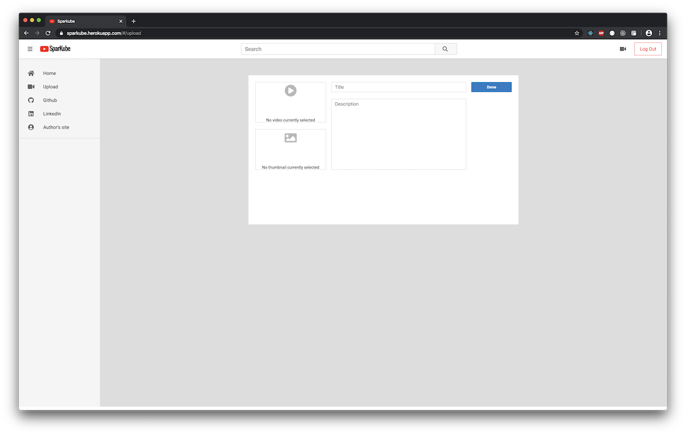

# Sparkube

[Sparkube Live](http://sparkube.herokuapp.com/#/)

Sparkube is a YouTube clone where users can freely watch and share vidoes.

## Technology used
- Data storage

    - PostgreSQL
    - Amazon S3 (AWS S3)

- Backend Development

    - Ruby on Rails

- Frontend Development

    - JavaScript
    - React
    - Redux
    - AJAX


## Features


* Logged in users can create, upload, edit, and delete their videos
    

* Likes and Dislikes are only available for logged in users
    

* Comments are enabled
    


* A sample of code for querying a video using ActiveRecord
    ```ruby
    def show
        @video = Video.includes(
        :user,
        :liked_users,
        :disliked_users,
        :comments => [:user]
        ).find(params[:id])
    end
    ```
